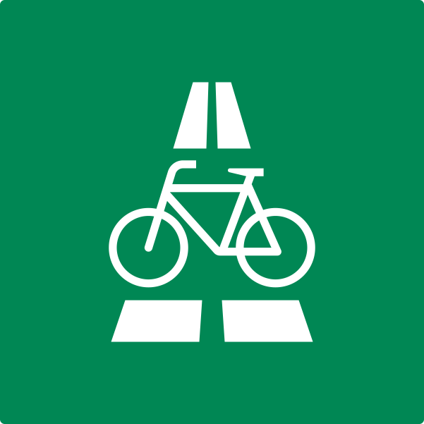

<div align="center">
    
    <h1>Radschnellwege Viewer</h1>
</div>
[](https://github.com/ohrie/radschnellwege-viewer/actions/workflows/deploy.yml)

Look at all the Radschnellwege in Germany planned, being built and already build. This project is depending on [radschnellwege](https://github.com/ohrie/radschnellwege), which contains the data of the cycle highways for this map.

## Project setup

Execute
```
npm install
```
Then fill out `.env` with your Mapbox Data.

### Compiles and hot-reloads for development
```
npm run serve
```

### Compiles and minifies for production
```
npm run build
```

### Lints and fixes files
```
npm run lint
```

### About
This project is based on [Vue CLI](https://cli.vuejs.org/).
Licensed under MIT License.